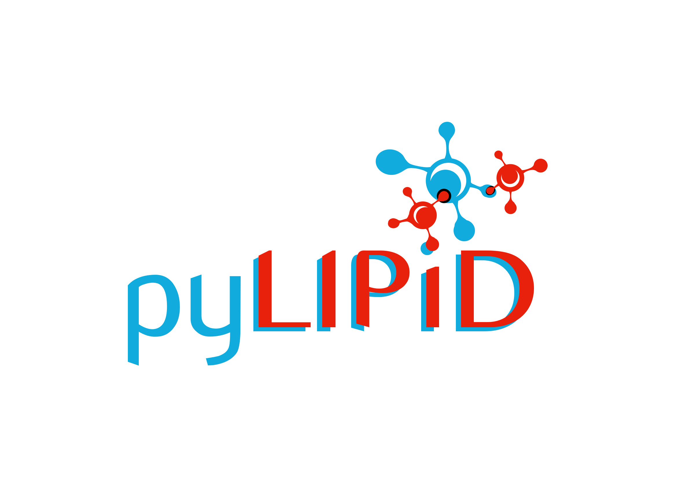

==========================================================
PyLipID - A Python Library For Lipid Interactions Analysis
==========================================================

PyLipID is a python library for analyzing lipid interactions with membrane proteins from
Molecular Dynamics Simulations. PyLipID has the following main features, please check out
the tutorials for examples and the documentations for the API functionalities:

* Analysis of lipid interactions with protein residues using a couple of metrics.
* Detection of binding sites via calculating community structures in the interactions networks.
* Analysis of lipid interactions with binding sites using a couple of metrics.
* Calculation of lipid koff and residence time for protein residues and binding sites.
* Generation of representative bound poses for binding sites.
* Analysis of bound poses for binding sites via automated clustering scheme.
* Adoption of a dual-cutoff scheme to overcome the 'cage-rattling' effect of coarse-grained simulations.
* Generation of manuscript-ready figures for analysis.

Installation
============

To install the PyLipID Python package, you need a few Python package dependencies. These dependencies
include:

- mdtraj
- numpy
- pandas
- matplotlib
- seaborn
- networkx
- scipy
- python-louvain
- logomaker
- statsmodels
- scikit-learn
- tqdm
- kneebow

If these dependencies are not available in their required versions, the installation will fail. We thus
recommend using the package installer pip:

``pip install pylipid``

If you know what you are doing and want to build from the source, the package is also available for
download on Github via:

``git clone https://github.com/wlsong/PyLipID``