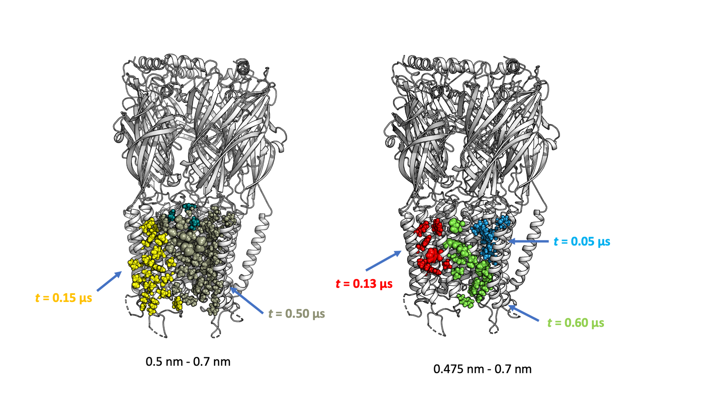
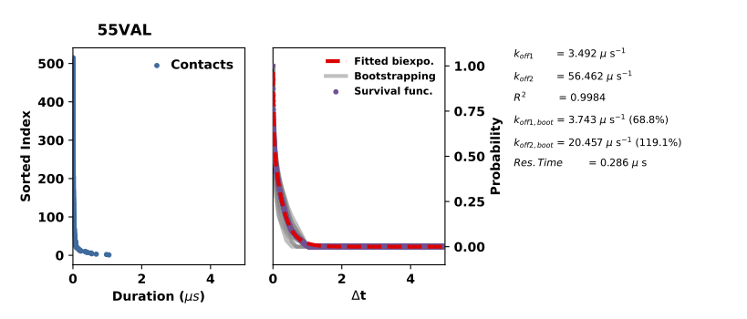
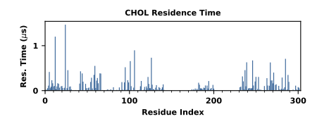
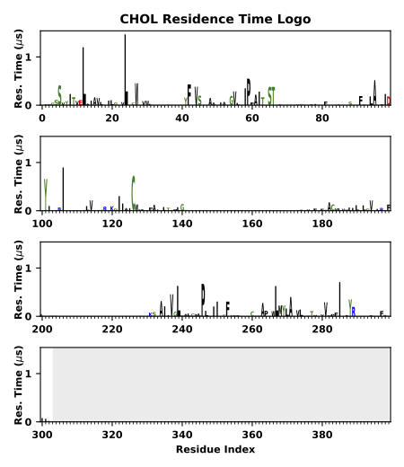
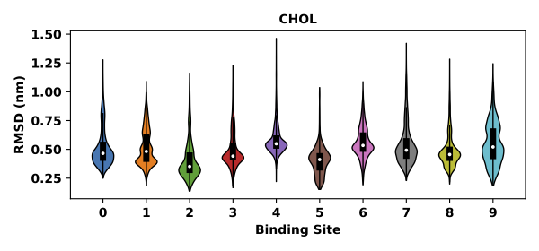
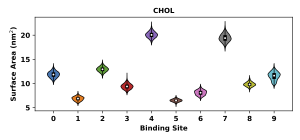

=======
Gallery
=======

**Most representative bound poses**

.. image:: static/top_ranked_poses.png
    :align: center

**Interaction hotspots**

.. image:: tutorials/statics/surface_hotspots.png
    :align: center

**Binding Site analysis**

**Koff plot**

**Interaction plot**

**Logo plot**

**Correlation coefficient**

.. image:: static/CorrCoef.png
    :align: center

**Bound pose RMSD**

**Binding site surface**

